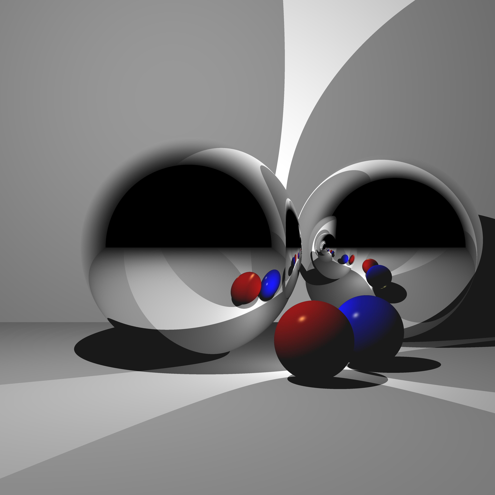
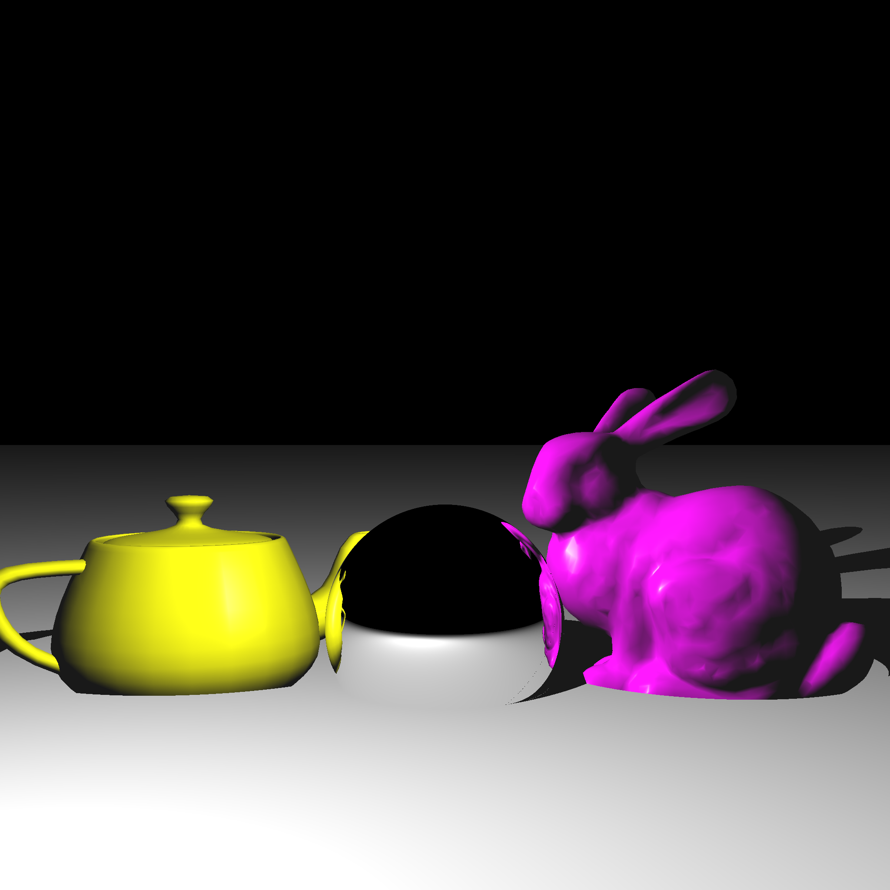

# Portfolio

---

## Projects

### Dynamic Geometry and Deferred Rendering

#### Skills used
* Object transformation with Matrix Stacks
* Render to texture
* Bloom Post-Processing
 

---
### Ray Tracer

#### Skills Used
* Linear Algebra
* Developing a large C++ program with minimal help outside of the standard library
* Good debugging practices in Visual Studio
 

---
### [Flocking Algorithm in Unity](https://github.com/LBess/flocking-algorithm)

#### Skills Used
* Understanding of the elegant mathematical behaviors to simulate movement.
* Inheritance in C#
* Unity Game Engine basics (Particularly physics and prefabs)
 

---
### [Classic Snake game in Python](https://github.com/LBess/snake)

#### Skills Used
* Knowledge of how screens draw/update images
* Object Oriented Programming (OOP) in Python
* Pygame library basics
 

---
### [Maze game in C++](https://github.com/LBess/cave-runner)

#### Skills Used
* Adjacency matrix implentation of a graph
* Breadth First Search (BFS) implementation for AI
* Ncurses library basics
 

---
#### Questions, comments, or just want to say hello? I can be reached at lbessell@tamu.edu
